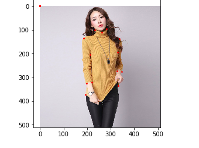

# tianchi_taobao_2018
阿里天池2018 Keypoints Detection of Apparel-Challenge the Baseline 

> * 数据预处理
> * 训练模型
> * 用模型去预测新的点的位置


## 数据预处理

使用csv_hebing.py 将两个train1 train2的图片下的csv文件数据合并


### 相关处理函数


1.处理csv文件里数据的下划线

```python

def splitUnderline(landmarks):
    """ 将下划线去除 
    传入值：landmarks_frame_train_one.iloc[n,2:] 如：232_100_1 
    返回值 所有点的x,y,v形成的数组 
    """
    point_data = []
    for i in landmarks:
        point = i.split('_') #从 232_100_1 中提取出 232 100 1
        x = int(point[0])
        y = int(point[1])
        v = int(point[2])
        point_data.append(x)
        point_data.append(y)
        point_data.append(v)
    return point_data

```

2.从csv文件中读出图片的信息 

```python

def ReadImgFromCsv(csvdir,n=65,istrain=True):
    """从csv文件中读出图片的信息 
    参数：csvdir--csv文件的地址
         n -- 代表传入第几个图片 也即：n是下标
         istrain -- 代表是否为训练集数据
    返回值：img的路径，img的种类，landmark的值
    
    exmaple:
    Image name: Images/blouse/00eda65257cd41e771357bfa93390498.jpg
    Image Kinds: blouse
    Landmarks shape: (24, 3)
    First 4 Landmarks: [[232. 100.   1.]
     [283.  94.   1.]
     [263. 109.   1.]
     [185. 135.   1.]]
    """
    landmarks_frame_train_one = pd.read_csv(csvdir)
    img_name = landmarks_frame_train_one.iloc[n,0]
    img_kind = landmarks_frame_train_one.iloc[n,1]
    if istrain == False:
        print('Image name: {}'.format(img_name))
        print('Image Kinds: {}'.format(img_kind))
        return img_name,img_kind
    landmarks = landmarks_frame_train_one.iloc[n,2:]


    point_data = pd.Series(splitUnderline(landmarks))
    landmarks = point_data.as_matrix()
    landmarks = landmarks.astype('float').reshape(-1, 3)

    print('Image name: {}'.format(img_name))
    print('Image Kinds: {}'.format(img_kind))
    print('Landmarks shape: {}'.format(landmarks.shape))
    print('First 4 Landmarks: {}'.format(landmarks[:4]))
    return img_name,img_kind,landmarks


```


3.画出衣服上的点：


```python

def show_landmarks(image, landmarks):
    """Show image with landmarks"""
    plt.imshow(image)
    plt.scatter(landmarks[:, 0], landmarks[:, 1], s=10, marker='.', c='r')
    plt.pause(0.001)  # pause a bit so that plots are updated


```





## 训练模型

使用Xception来训练


```python

class Xception(nn.Module):
    """
    Xception optimized for the ImageNet dataset, as specified in
    https://arxiv.org/pdf/1610.02357.pdf
    """
    def __init__(self, num_classes=1000):
        """ Constructor
        Args:
            num_classes: number of classes
        """
        super(Xception, self).__init__()

        
        self.num_classes = num_classes

        self.conv1 = nn.Conv2d(3, 32, 3,2, 0, bias=False)
        self.bn1 = nn.BatchNorm2d(32)
        self.relu = nn.ReLU(inplace=True)

        self.conv2 = nn.Conv2d(32,64,3,bias=False)
        self.bn2 = nn.BatchNorm2d(64)
        #do relu here

        self.block1=Block(64,128,2,2,start_with_relu=False,grow_first=True)
        self.block2=Block(128,256,2,2,start_with_relu=True,grow_first=True)
        self.block3=Block(256,728,2,2,start_with_relu=True,grow_first=True)

        self.block4=Block(728,728,3,1,start_with_relu=True,grow_first=True)
        self.block5=Block(728,728,3,1,start_with_relu=True,grow_first=True)
        self.block6=Block(728,728,3,1,start_with_relu=True,grow_first=True)
        self.block7=Block(728,728,3,1,start_with_relu=True,grow_first=True)

        self.block8=Block(728,728,3,1,start_with_relu=True,grow_first=True)
        self.block9=Block(728,728,3,1,start_with_relu=True,grow_first=True)
        self.block10=Block(728,728,3,1,start_with_relu=True,grow_first=True)
        self.block11=Block(728,728,3,1,start_with_relu=True,grow_first=True)

        self.block12=Block(728,1024,2,2,start_with_relu=True,grow_first=False)

        self.conv3 = SeparableConv2d(1024,1536,3,1,1)
        self.bn3 = nn.BatchNorm2d(1536)

        #do relu here
        self.conv4 = SeparableConv2d(1536,2048,3,1,1)
        self.bn4 = nn.BatchNorm2d(2048)

        self.fc = nn.Linear(2048, num_classes)


        #------- init weights --------
        for m in self.modules():
            if isinstance(m, nn.Conv2d):
                n = m.kernel_size[0] * m.kernel_size[1] * m.out_channels
                m.weight.data.normal_(0, math.sqrt(2. / n))
            elif isinstance(m, nn.BatchNorm2d):
                m.weight.data.fill_(1)
                m.bias.data.zero_()
        #-----------------------------


    def forward(self, x):
        x = self.conv1(x)
        x = self.bn1(x)
        x = self.relu(x)
        
        x = self.conv2(x)
        x = self.bn2(x)
        x = self.relu(x)
        
        x = self.block1(x)
        x = self.block2(x)
        x = self.block3(x)
        x = self.block4(x)
        x = self.block5(x)
        x = self.block6(x)
        x = self.block7(x)
        x = self.block8(x)
        x = self.block9(x)
        x = self.block10(x)
        x = self.block11(x)
        x = self.block12(x)
        
        x = self.conv3(x)
        x = self.bn3(x)
        x = self.relu(x)
        
        x = self.conv4(x)
        x = self.bn4(x)
        x = self.relu(x)

        x = F.adaptive_avg_pool2d(x, (1, 1))
        x = x.view(x.size(0), -1)
        x = self.fc(x)

        return x


```

## 用模型去预测新的点的位置

目前的训练结果还不是很好


